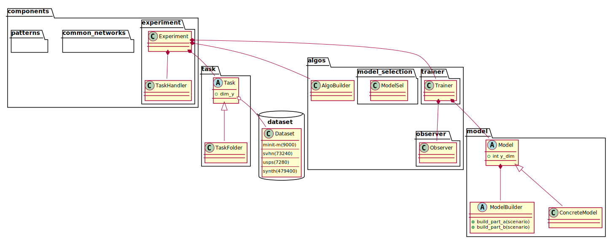

LibDG: Library of Domain Generalization
================================================
## Domain Generalization and libDG

### Domain Generalization

Domain Generalization aims at learning domain invariant features by utilizing data from multiple domains so the learned feature can generalize to new unseen domains. 


### Why a dedicated library?

Domain generalization algorithm try to learn domain invariant features by adding regularization upon the ERM (Emperical Risk Minimization) loss. A typical setting of evaluating domain generalization algorithm is the so called leave-one-domain-out scheme, where one dataset is collected from each distribution. Each time, one dataset/domain is left as test-set to estimate the generalization performance of a model trained upon the rest of domains/datasets.


Once you came across a claim,  that a domain generalization algorithm A can generate a "better" model  h upon some datasets D with "better" performance compared to other algorithms, have you ever wondered:

- Is this mostly attributed to a more "powerful" neural network architecture of model A compared to others? What will happen if I change the backbone neural network of algorithm A from ResNet to AlexNet?
- Is this mostly attributed the protocol of estimating the generalization performance? e.g. dataset split, Will this algorithm "work" for my datasets?
- Is this mostly attributed to the "clever" regularization algorithm or a special loss function A has used for the neural network?

To maximally decouple these attributing factors, LibDG was implemented with software design patterns, where

- Domain generalization algorithms was implemented in a way that keeps the underlying neural network architecture transparent, i.e. the concrete neural network architecture can be replaced like a plugin through specifying a custom neural network architecture implemented in a python file. See [Specify Custom Neural Networks for an algorithm](libdg/compos/doc_custom_nn.md) 

- To evaluate a domain generalization algorithm's performance, the user can specify a "Task" in the form of custom python file and feed into the command line argument, so that all domain generalization algorithms could be compared fairly. See [Task Specification](libdg/tasks/README.md) 

# Getting started
## Installation

- Install via python-poetry:
Read the python-poetry documentation https://python-poetry.org/ and use the configuration file in this repository.

- **Or** only install dependencies via pip
```
git clone git@github.com:smilesun/libDG.git
cd libDG
pip install -r requirements.txt
```

## Basic usage
Suppose you have the dependencies ready, change directory to the repository:
```
cd libDG
```
LibDG comes with some minimal toy-dataset to test its basis functionality. To train a domain generalization model with a user-specified task, one can execute a command similar to the following.
```
python main_out.py --te_d=caltech --tpath=examples/tasks/task_vlcs.py --debug --bs=20 --aname=diva --gamma_y=7e5 --gamma_d=1e5
```
where `--tpath` specifies the path of a user specified python file which defines the domain generalization task, see Example in [Task Specification](libdg/tasks/README.md). `--aname` specifies which algorithm to use, see [Available Algorithms](libdg/algos/README.md), `--bs` specifies the batch size, `--debug` restrain only running for 2 epochs and save results with prefix 'debug'. For DIVA, the hyper-parameters include `--gamma_y=7e5` which is the relative weight of ERM loss compared to ELBO loss, and  `--gamma_d=1e5`, which is the relative weight of domain classification loss compared to ELBO loss.
For usage of other arguments, check with 

```
python main_out.py --help
```

See also [Examples](./examples.sh).

### Output structure (results storage) and Performance Measure
[Output structure and Performance Measure](./doc_output.md)

## Custom Usage

### Define your task 
Do you have your own data that comes from different domains? Create a task for your data and benchmark different domain generlization algorithms according to the following example. See
[Task Specification](libdg/tasks/README.md) 

### Custom Neural network 
This library decouples the concept of algorithm (model) and neural network architecture where the user could plugin different neural network architectures for the same algorithm. See
[Specify Custom Neural Networks for an algorithm](libdg/compos/doc_custom_nn.md) 

# Design


# Extend or contribute to libDG with a custom domain generalization algorithm
[Extend or Contibute](./doc_extend_contribute.md)

# Credits
Contact: Xudong Sun (smilesun.east@gmail.com, Institute of AI for Health, Helmholtz Munich, Germany)

Please cite our paper if you use this code in your research:
```
@inproceedings{sun2021hierarchical,
  title={Hierarchical Variational Auto-Encoding for Unsupervised Domain Generalization},
  author={Sun, Xudong and Buettner, Florian},
  booktitle={ICLR 2021 RobustML workshop, https://arxiv.org/pdf/2101.09436.pdf},
  year={2021}
}
```
