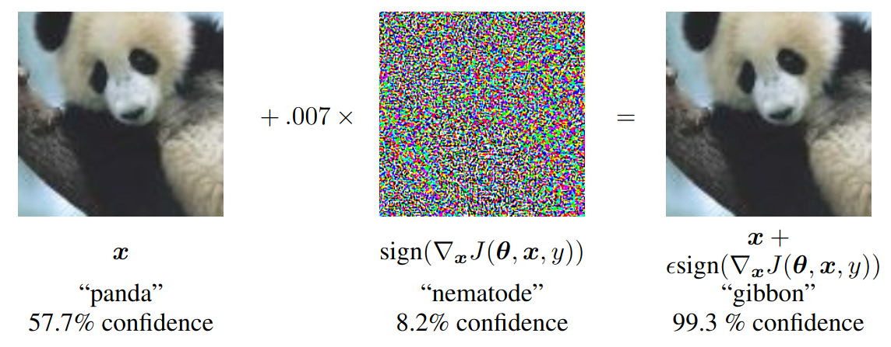
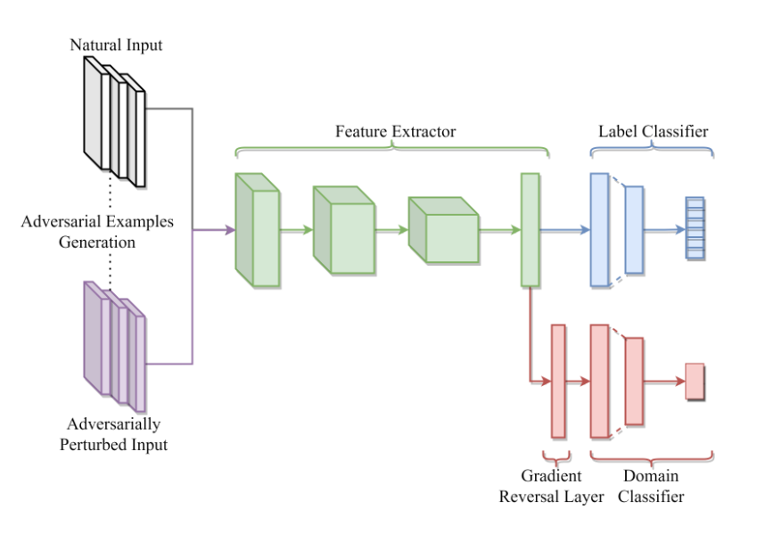

# Trainer DIAL
## Domain Invariant Adversarial Learning

The algorithm introduced in https://arxiv.org/pdf/2104.00322.pdf uses adversarial learning to tackle the task of domain generalization. Therefore, the source domain is the natural dataset, while the target domain is generated using adversarial attack on the source domain.


## generating the adversarial domain

The generation of adversary images is demonstrated in figure 1.
The task is to find an adversary image $x'$ to the natural image $x$ with $||x- x'||$ small, such that the output of a classification network $\phi$ fulfills $||\phi(x) - \phi(x')||$ big. In the example in figure 1 you can for example see, that the difference between the left and the right image of the panda is unobservable, but the classifier does still classify them differently.

In Domainlab the adversary images are created starting from a random perturbation of the natural image $x'_0 = x + \sigma \tilde{x}~$, $\tilde{x} \sim \mathcal{N}(0, 1)$ and using $n$ steps in a gradient descend with step size $\tau$ to maximize $||\phi(x) - \phi(x')||$. In general machine learning, the generation of adversary images is used during the training process to make networks more robust to adversarial attacks.

<div style="align: center; text-align:center;">
 
 <div class="caption">Figure 1: adversarial domain (Image source: Figure 1 of Explaining and Harnessing Adversarial Examples https://arxiv.org/abs/1412.6572) </div>
</div>

## network structure

The network consists of three parts. At first a feature extractor, which extracts the main characteristics of the images. This features are then used as the input to a label classifier and a domain classifier.
During training the network is optimized to a have low error on the classification task, while ensuring that the internal representation (output of the feature extractor) cannot discriminate between the natural and adversarial domain. This goal can be archived by using a special loss function in combination with a gradient reversal layer.

<div style="align: center; text-align:center;">
 
 <div class="caption">Figure 2: network structure (Image source: Figure 1 of Domain Invariant Adversarial Learning https://arxiv.org/pdf/2104.00322.pdf) </div>
</div>


[comment]: <> (## loss function and gradient reversal layer)

[comment]: <> (The loss function of the algorithm is a combination of three terms:)


[comment]: <> (standard cross entropy loss between the predicted label probabilities and the actual label $CE_{nat}$ for the natural domain, $CE_{adv}$ for the adversarial domain)

[comment]: <> (Kullback-Leibler divergence between classifier output on the natural images and their adversarial counterparts $KL$)

[comment]: <> (standard cross-entropy loss between predicted domain probability and domain label $D_{nat}$ for the natural domain, $D_{adv}$ for the adversarial domain)

[comment]: <> (The loss functions are given by:)


[comment]: <> ($$)
[comment]: <> (DIAL_{CE} = CE_{nat} + \lambda ~ CE_{adv} - r / D_{nat} + D_{adv} / )

[comment]: <> ($$)

[comment]: <> ($$)
[comment]: <> (DIAL_{KL} = CE_{nat} + \lambda ~ KL - r / D_{nat} + D_{adv} / )
[comment]: <> ($$)


[comment]: <> (The task is to minimize the label classification loss while maximizing the classification loss for the adversarial domain. Therefore a gradient reversal layer is inserted into the network, right in front of the domain classifier. The layer leaves the input unchanged during forward propagation and reverses the gradient by multiplying it with a negative scalar during the back-propagation. This ensures that the weights in the feature extractor are actually chosen such that they maximize the domain classification loss. The parameter of the gradient reversal layer is initialized to a small value and is then gradually increased to $r$.)

## loss function and gradient reversal layer

The loss function for in the DomainLab package is different to the one described in the paper. It consists of the standard cross entropy loss between the predicted label probabilities and the actual label for the natural domain ($CE_{nat}$) and for the adversarial domain ($CE_{adv}$).
The adversarial domain is weighted by the parameter $\gamma_\text{reg}$.

$$
\text{loss} = CE_{nat} + \gamma_\text{reg}\,CE_{adv}
$$


---

This procedure yields to the following availability of hyperparameter:
- `--dial_steps_perturb`: how many gradient step to go to find an adversarial image ($n$ from "*generating the adversarial domain*")
- `--dial_noise_scale`: variance of gaussian noise to inject on pure image ($\sigma$ from "*generating the adversarial domain*")
- `--dial_lr`: learning rate to generate adversarial images ($\tau$ from "*generating the adversarial domain*")
- `--dial_epsilon`: pixel wise threshold to perturb images
- `--gamma_reg`: ? ($\epsilon$ in the paper)
- `--lr`: learning rate ($\alpha$ in the paper)

## Examples

```
python main_out.py --te_d=0 --task=mnistcolor10 --model=erm --trainer=dial --nname=conv_bn_pool_2
```


```shell
python main_out.py --te_d=0 --task=mnistcolor10 --keep_model --model=erm --trainer=dial --nname=conv_bn_pool_2
```
### Train DIVA model with DIAL trainer

```shell
python main_out.py --te_d 0 1 2 --tr_d 3 7 --task=mnistcolor10 --model=diva --nname=conv_bn_pool_2 --nname_dom=conv_bn_pool_2 --gamma_y=7e5 --gamma_d=1e5 --trainer=dial
```
### Set hyper-parameters for trainer as well
```shell
python main_out.py --te_d 0 1 2 --tr_d 3 7 --task=mnistcolor10 --model=diva --nname=conv_bn_pool_2 --nname_dom=conv_bn_pool_2 --gamma_y=7e5 --gamma_d=1e5 --trainer=dial --dial_steps_perturb=1
```
