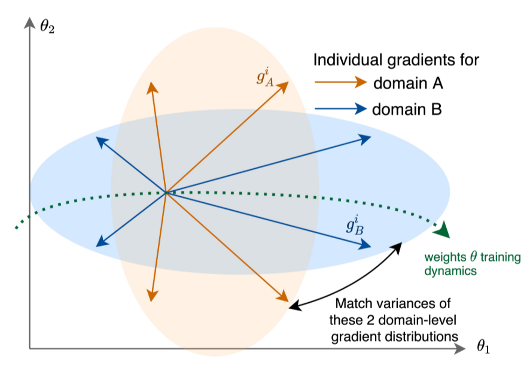

# Fishr: Invariant Gradient Variances for Out-of-distribution Generalization

The goal of the Fishr regularization technique is locally aligning the domain-level loss landscapes 
around the final weights, finding a minimizer around which the inconsistencies between
the domain-level loss landscapes are as small as possible.
This is done by considering second order terms during training, matching
the variances between the domain-level gradients.

  
 
Figure 1: Fishr matches the domain-level gradient variances of the
distributions across the training domains (Image source: Figure 1 of "Fishr:
Invariant gradient variances for out-of-distribution generalization") 

### Quantifying inconsistency between domains
Intuitively, two domains are locally inconsistent around a minimizer, if a small
perturbation of the minimizer highly affects its optimality in one domain, but only
minimally affects its optimality in the other domain. Under certain assumptions, most importantly 
the Hessians being positive definite, it is possible to measure the inconsistency between two domains
$A$ and $B$ with the following inconsistency score:

$$
\mathcal{I}^\epsilon ( \theta^* ) = \text{max}_{(A,B)\in\mathcal{E}^2} \biggl( \mathcal{R}_B(\theta^* ) -  \mathcal{R}_A( \theta^* ) + \text{max}_{\frac{1}{2}\theta^T H_A \theta\leq\epsilon}\frac{1}{2}\theta^T H_B \theta \biggl) 
$$

, whereby $\theta^*$ denotes the minimizer, $\mathcal{E}$ denotes the set of training domains,
$H_e$ denotes the Hessian for $e\in\mathcal{E}$, $\theta$ denote the network parameters
and $\mathcal{R}_e$ for $e\in\mathcal{E}$ denotes the domain-level ERM objective.
The Fishr regularization method forces both terms on the right hand side 
of the inconsistency score to become small. The first term represents the difference
between the domain-level risks and is implicitly forced to be small by applying
the Fishr regularization. For the second term it suffices to align diagonal approximations of the
domain-level Hessians, matching the variances across domains.

### Matching the Variances during training
Let $\mathcal{E}$ be the space of all training domains, and let $\mathcal{R}_e(\theta)$ be the ERM
objective. Fishr minimizes the following objective function during training:

$$
\mathcal{L}(\theta) = \frac{1}{|\mathcal{E}|}\sum_{e\in\mathcal{E}} \mathcal{R}_\mathcal{E}(\theta) + \lambda \mathcal{L}_{\text{Fishr}}(\theta)
$$

, whereby

$$
\mathcal{L}_\text{Fishr}(\theta) = \frac{1}{|\mathcal{E}|}\sum_{e\in\mathcal{E}} \| v_e -v \|^2_2
$$

with $v_e$ denoting the variance between the gradients of domain $e\in\mathcal{E}$ and
$v$ denoting the average variance of the gradients across all domains, i.e.
$v = \frac{1}{|\mathcal{E}|}\sum_{e\in\mathcal{E}} v_e$.

### Implementation
The variance of the gradients within each domain can be computed with the
BACKPACK package (see: Dangel, Felix, Frederik Kunstner, and Philipp Hennig.
"Backpack: Packing more into backprop." https://arxiv.org/abs/1912.10985). 
Further on, we use $ \textnormal{Var}(G) \approx \textnormal{diag}(H) $.
The Hessian is then approximated by the Fisher Information Matrix, which
again is approximated by an empirical estimator for computational efficiency.
For more details, see the reference below or the domainlab code.

_Reference:_
Rame, Alexandre, Corentin Dancette, and Matthieu Cord. "Fishr:
Invariant gradient variances for out-of-distribution generalization."
International Conference on Machine Learning. PMLR, 2022.