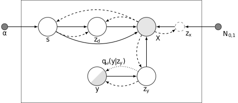

# HDUVA: HIERARCHICAL VARIATIONAL AUTO-ENCODING FOR UNSUPERVISED DOMAIN GENERALIZATION

HDUVA builds on a generative approach within the framework of variational autoencoders to facilitate generalization to new domains without supervision. HDUVA learns representations that disentangle domain-specific information from class-label specific information even in complex settings where domain structure is not observed during training. 

## Model Overview
More specifically, HDUVA is based on three latent variables that are used to model distinct sources of variation and are denoted as $z_y$, $z_d$ and $z_x$. $z_y$ represents class specific information, $z_d$ represents domain specific information and $z_x$ models residual variance of the input. We introduce an additional hierarchical level and use a continuous latent representation s to model (potentially unobserved) domain structure. This means that we can encourage disentanglement of the latent variables through conditional priors without the need of conditioning on a one-hot-encoded, observed domain label. The model along with its parameters and hyperparameters is shown in Figure 1: 

  
 
Figure 1: Probabilistic graphical model for HDUVA:Hierarchical Domain Unsupervised Variational Autoencoding. 

Note that as part of the model a latent representation of $X$ is concatentated with $s$ and $z_d$ (dashed arrows), requiring respecive encoder networks.

## Evidence lower bound and overall loss
The ELBO of the model can be decomposed into 4 different terms: 

Likelihood: $E_{q(z_d, s|x), q(z_x|x), q(z_y|x)}\log p_{\theta}(x|s, z_d, z_x, z_y)$ 

KL divergence weighted as in the Beta-VAE: $-\beta_x KL(q_{\phi_x}(z_x|x)||p_{\theta_x}(z_x)) - \beta_y KL(q_{\phi_y}(z_y|x)||p_{\theta_y}(z_y|y))$ 

Hierarchical KL loss (domain term): $- \beta_d E_{q_{\phi_s}(s|x), q_{\phi_d}(z_d|x, s)} \log \frac{q_{\phi_d}(z_d|x, s)}{p_{\theta_d}(z_d|s)}$

Hierarchical KL loss  (topic term): $-\beta_t E_{q_{\phi_s}(s|x)}KL(q_{\phi_s}(s|x)||p_{\theta_s}(s|\alpha))$

In addition, we construct the overall loss by adding an auxiliary classsifier, by adding an additional term to the ELBO loss, weighted with $\gamma_y$:

## Hyperparameters loss function
For fitting the model, we need to specify the 4 $\beta$-weights related to the the different terms of the ELBO ( $\beta_x$ , $\beta_y$, $\beta_d$, $\beta_t$)  as well as $\gamma_y$. 

## Model parameters
In addition to these hyperparameters, the following model parameters can be specified: 

 - Size of latent space for domain-specific information: zd_dim 
 - Size of latent space for residual variance: zx_dim
 - Size of latent space for class-specific information: zy_dim
 - Size of latent space for topics $s$: topic_dim
 - Size of latent space for latent image representation for topic: topic_h_dim
 - Size of latent space for latent image representation for domain: img_h_dim

Finally, 2 models need to be specified: A network converting an image to a topic distribution (of size topic_h_dim) and an encoder converting an image to a latent representation that can be concatenated to $z_d$ (size img_h_dim). The names and paths of the networks are: 

- nname_topic_distrib_img2topic
- npath_topic_distrib_img2topic

and
- nname_encoder_sandwich_layer_img2h4zd
- npath_encoder_sandwich_layer_img2h4zd

## Hyperparameter warmup
Finally, the number of epochs for hyper-parameter warm-up can be specified via the argument warmup
