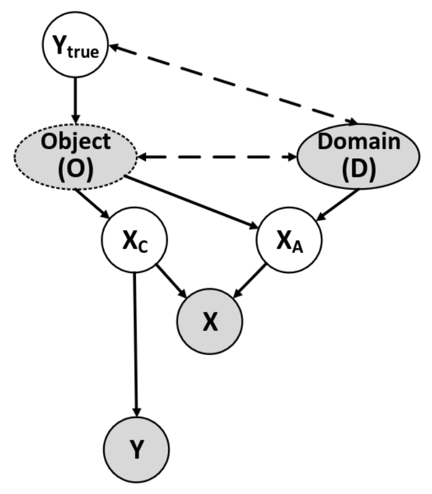

# MatchDG: Domain Generalization using Causal Matching

This algorithm introduced in https://arxiv.org/pdf/2006.07500.pdf is motivated by causality theory. The authors try to enforce, that a model does classify an image only on the object information included in the image and not on the domain information.

## Motivation: causality theory

The authors of the paper motivate their approach by looking at the data-generation process. The underlying causal model (SCM) is given in figure 1. In the graphic one starts of from the object $O$ and the domain D. The object is directly influenced by its true label $y_\text{true}$ while label and domain do only correlate with each other. Additionally the object is correlated with the domain conditioned on $y_\text{true}$. The information from the object $O$ and the domain $D$ do together form the image $x$ which shall be classified by the neuronal network. Doing so, the object does contribute to the image by providing high-level causal features $x_C$ that are common to any image of the same object. This features are the key for classifying the object, as there is only subliminal influence of the domain, therefore the prediction $y$ is only depending on this causal features. The second contribution to the image are domain-dependent high-level features of the object $x_A$, which depend on both, the object $O$ and the domain $D$. This domain-dependent features shall not be respected in the classification as there is a high influence of the domain.

  
 
Figure 1: Structural causal model for the data-generating process. Observed variables are shaded; dashed arrows denote correlated nodes. Object may not be observed. (Image source: Figure 2 of Domain Generalization using Causal Matching https://arxiv.org/pdf/2006.07500.pdf) 

## Network

Before defining the network, one needs to define three sets: 
- $\mathcal{X}$: image space with $x \in \mathcal{X}$ 
- $\mathcal{C}$: causal feature space with $x_C \in \mathcal{C}$
- $\mathcal{Y}$: label space with $y \in \mathcal{Y}$ 

For the classification the goal is to classify an object only based on its causal features $x_C$, hence we define a network $h: \mathcal{C} \rightarrow \mathcal{Y}$. Since $x_C$ for an image $x$ is unknown, one needs to learn a representation function $\phi: \mathcal{X} \rightarrow \mathcal{C}$. By assumption for two images $x_j^{(d)}$ and $x_k^{(d')}$ of the same class, but from different domains $\text{ dist}\left(\phi(x_j^{(d)}), \phi(x_k^{(d')})\right)$ is small to enforce that the features in $\phi(x) \in \mathcal{C}$ are affected by the associated object and not the domain. This motivates the definition of a match function $\Omega:  \mathcal{X} \times \mathcal{X} \rightarrow \{0, 1\}$, 

$$
\Omega(x_j, x_k) = \begin{cases}
1 \quad & \text{$x_j$ and $x_k$ correspond to the same object} \\
0 & \text{otherwise}
\end{cases} 
$$

by using 

$$
\sum_{\substack{\Omega(x_j, x_k) = 1\\ d \neq d'}} \text{dist}\left(\phi(x_j^{(d)}), \phi(x_k^{(d')})\right) = 0.
$$

Together the networks form the desired classifier $f = h \circ \phi : \mathcal{X} \rightarrow \mathcal{Y}$.

 
## Training

**Initialisation:** first of all match pairs of same-class data points from different domains are constructed. Given a data point, another data point with the same label from a different domain is selected randomly. The matching across domains is done relative to a base domain, which is chosen as the domain with the highest number of samples for that class. This leads to a matched data matrix $\mathcal{M}$ of size $(N', K)$ with $N'$ sum of the size of base domains over all classes and $K$ number ob domains.

**Phase 1:** sample batches $(B, K)$ from $\mathcal{M}$, with $B$ is batch size and train a match function $\Omega:  \mathcal{X} \times \mathcal{X} \rightarrow \{0, 1\}$, by adapting the network parameter in $\phi$ to minimize the contrastive loss for every positive match pair $(x_j, x_k)$

$$
l(x_j, x_k) = -\log\left(\frac{ \exp\left( \frac{\text{sim}(j, k)}{\tau} \right) }{ \exp\left( \frac{\text{sim}(j, k)}{\tau} \right) + \sum\limits_{\substack{i=0\\ y_i \neq y_j}} \exp\left( \frac{\text{sim}(j, i)}{\tau} \right) }\right)
$$

where $\text{sim}(a, b) = \frac{\phi(x_a)^T \phi(x_b)}{||\phi(x_a)||~||\phi(x_b)||}$ is the cosine similarity and $\tau$ is a hyperparameter (`--tau`).

After $t$ epochs (`--epos_per_match_update`) the match tensor is updated. The same procedure of selecting a base domain for each class is used, but instead of randomly matching data points across domains, we find the nearest neighbor among the data point in base domain and data points in the other domains, having the same class label, with respect to $l_2$ distance between their representations $\phi_\text{epoch}(x)$.

**Phase 2:** Finally the classifier $f = h \circ \phi$ is trained using

$$
\underset{h, \phi}{\text{arg min}} ~ \sum_{d \in D} \sum_{i=1}^{n_d} \, l\left(h(\phi(x_i^{(d)})), y_i^{(d)}\right) + \gamma_{\text{reg}} \sum_{\substack{\Omega(x_j, x_k) = 1\\ d \neq d'}} \text{dist}\left(\phi(x_j^{(d)}), \phi(x_k^{(d')})\right).
$$

The training of $h$ and $\phi$ is performed from scratch. The trained network $\phi^*$ from phase 1 is only used to update the matched data matrix using yielding $\Omega$. 

---

This procedure yields to the following availability of hyperparameter:
- `--tau`: hyperparameter in the contrastive loss. In the paper this parameter is chosen to be $0.05$ in all experiments. ($\tau$ from phase 1)
- `--epochs_ctr`: number of epochs for minimizing the contrastive loss in phase 1.
- `--epos_per_match_update`: Number of epochs before updating the match tensor. ($t$ from phase 1)
- `--gamma_reg`: weight for the regularization term in phase 2. ($\gamma_\text{reg}$ from phase 2)
