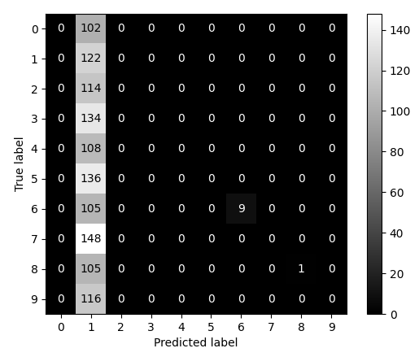
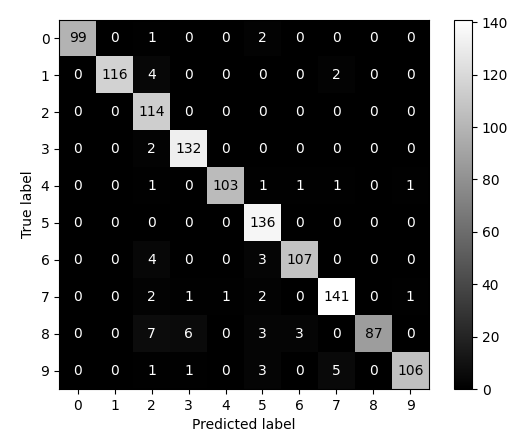

# colored MNIST classification

We include in the DomainLab package colored verion of MNIST where the color correspond to domain and digit correspond to semantic concept that we want to classify. 

## colored MNIST dataset
We provide 10 different colored version of MNIST as 10 different domains which which number 0 to 9. The digit and background are colored differently, thus a color combination. 
An extraction from domain 0 is shown in Figure 1. 

<div style="align: center; text-align:center;">
digits 0 - 9: 


 <div class="caption">Figure 1: digits zero to nine from domain zero of colored MNIST </div>
</div>

<br/>
The available color combinations together with the domain number are shown in Figure 2. For each colors combination there are two domains available, such that each color does appear as foreground and as background color in different domains. 
<br/>

<div style="align: center; text-align:center;">
 domain 0: <br/>
 domain 1: <br/>
 domain 2: <br/>
 domain 3: <br/>
 domain 4: <br/>
 domain 5: <br/>
 domain 6: <br/>
 domain 7: <br/>
 domain 8: <br/>
 domain 9: 
 <div class="caption">Figure 2: digit zero from domain zero to nine of colored MNIST </div>
</div>
<br/>

## domain generalisation on colored MNIST

A particular hard task for domain classification is, if only a few training domains are available. We like to constitute this case by using just two domains for training which do include just two different colors, e.g. domain 0 and 3 from Figure 2. For testing we do choose domain 1 and 2 as the colors appearing here are far different from the ones used in training. 

For our test we like to compare diva and deepall, this was done using the following command lines:

### deepall

```
python main_out.py --te_d 1 2 --tr_d 0 3 --task=mnistcolor10 --epos=500 --bs=16 --aname=deepall --nname=conv_bn_pool_2 --san_check --san_num=8
```

### diva 

```
python main_out.py --te_d 1 2 --tr_d 0 3 --task=mnistcolor10 --epos=500 --bs=16 --lr=1e-3 --aname=diva --nname=conv_bn_pool_2 --nname_dom=conv_bn_pool_2 --gamma_y=1e5 --gamma_d=1e5 --san_check --san_num=8 --gen
```

**Notes**
- `--san_check` and `--san_num=8` are only used to generate the dataset extractions we plotted in figure 1 and 2.
- `--epos` was set high enough to end the training using the early stopping criterion.
- `--gen` for diva does not effect the training. If this keyword is passed to the command line, the image generation is started after the training has finished. The generated images are presented below.


### Results

For both algorithms the early stop criterion ended the training. Although diva is a more complex method which needs more time for one epoch of training, the total training time of dive was much lower than deepall, due to the fewer epochs. The performance of the trained models on the test domains are summarized in the following table:

| method    | epochs | acc       | precision | recall     | specificity | f1          | auroc     |
|-|-|-|-|-|-|-|-|
| deepall   | 288 | 0.11      | 0.2102521 | 0.10883814 | 0.9009278   | 0.035100866 | 0.8317412 |
| diva      | 24 | 0.9508333 | 0.9569898 | 0.94860333 | 0.994503    | 0.9506704   | 0.9992858 |

To give some more insights we can also look at the confusion matrix of both methods in Figure 3. We see that deepall does classify nearly all digits a ones, which does lead to the low accuracy close to 10 %, which is not better than random guessing. For diva we see a very good prediction over all classes.


<div style="align: center; text-align:center;">
 deepall: 
 , diva: 
 <div class="caption">Figure 3: confusion matrix for domain 1 and 2 after training on domain 0 and 3 </div>
</div>

<br/>

## image generation of diva

Diva comes with the possibility of image generation. The idea is to use the reconstruction network to reconstruct images from their latent representation while removing parts of the latent representation e.g. remove the part used to encode the class label or the domain label.


