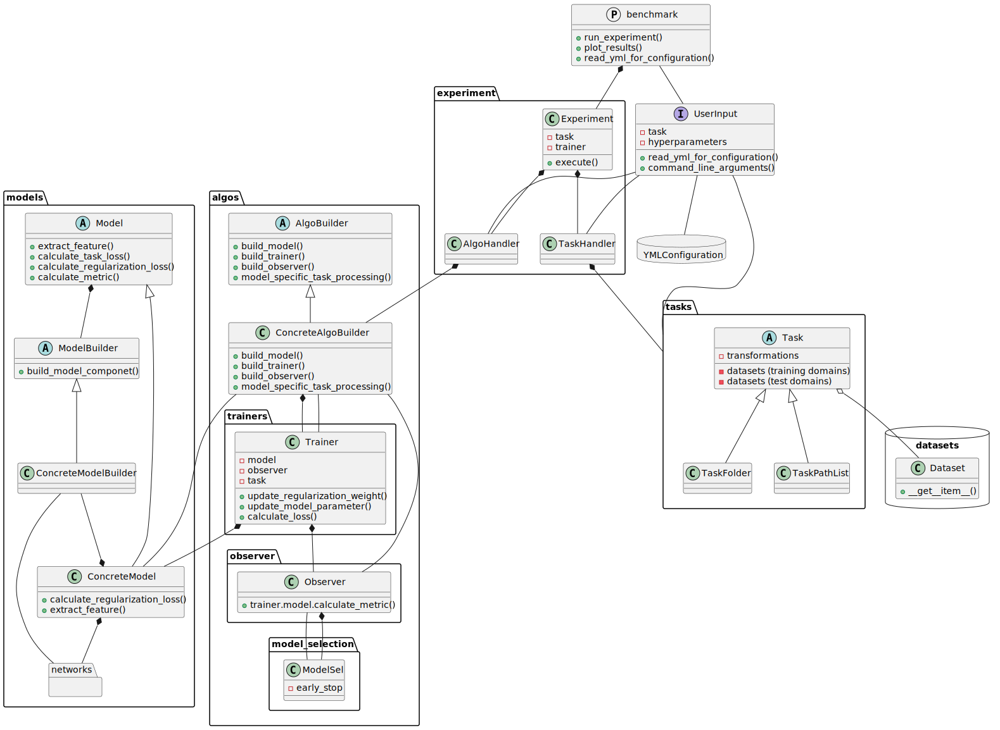

## Software Architecture and Design

## Code structure

domainlab/
├── algos
│   ├── a_algo_builder.py
│   ├── builder_api_model.py
│   ├── builder_custom.py
│   ├── builder_dann.py
│   ├── builder_diva.py
│   ├── builder_erm.py
│   ├── builder_hduva.py
│   ├── builder_jigen1.py
│   ├── __init__.py
│   ├── msels
│   ├── observers
│   ├── trainers
│   ├── utils.py
│   └── zoo_algos.py
├── arg_parser.py
├── cli.py
├── compos
│   ├── a_nn_builder.py
│   ├── builder_nn_alex.py
│   ├── builder_nn_conv_bn_relu_2.py
│   ├── builder_nn_external_from_file.py
│   ├── __init__.py
│   ├── nn_zoo
│   ├── pcr
│   ├── utils_conv_get_flat_dim.py
│   ├── vae
│   └── zoo_nn.py
├── dsets
│   ├── a_dset_mnist_color_rgb_solo.py
│   ├── dset_img_path_list.py
│   ├── dset_mnist_color_solo_default.py
│   ├── dset_poly_domains_mnist_color_default.py
│   ├── dset_subfolder.py
│   ├── __init__.py
│   ├── utils_color_palette.py
│   ├── utils_data.py
│   └── utils_wrapdset_patches.py
├── exp
│   ├── exp_cuda_seed.py
│   ├── exp_main.py
│   ├── exp_utils.py
│   └── __init__.py
├── exp_protocol
│   ├── aggregate_results.py
│   ├── benchmark.smk
│   ├── __init__.py
│   └── run_experiment.py
├── __init__.py
├── mk_exp.py
├── models
│   ├── a_model_classif.py
│   ├── a_model.py
│   ├── args_jigen.py
│   ├── args_vae.py
│   ├── __init__.py
│   ├── interface_vae_xyd.py
│   ├── model_custom.py
│   ├── model_dann.py
│   ├── model_diva.py
│   ├── model_erm.py
│   ├── model_hduva.py
│   ├── model_jigen.py
│   └── model_vae_xyd_classif.py
├── tasks
│   ├── a_task_classif.py
│   ├── a_task.py
│   ├── b_task_classif.py
│   ├── b_task.py
│   ├── __init__.py
│   ├── task_dset.py
│   ├── task_folder_mk.py
│   ├── task_folder.py
│   ├── task_mini_vlcs.py
│   ├── task_mnist_color.py
│   ├── task_pathlist.py
│   ├── task_utils.py
│   ├── utils_task_dset.py
│   ├── utils_task.py
│   └── zoo_tasks.py
├── utils
│   ├── flows_gen_img_model.py
│   ├── generate_benchmark_plots.py
│   ├── get_git_tag.py
│   ├── hyperparameter_gridsearch.py
│   ├── hyperparameter_sampling.py
│   ├── __init__.py
│   ├── logger.py
│   ├── override_interface.py
│   ├── perf_metrics.py
│   ├── perf.py
│   ├── sanity_check.py
│   ├── test_img.py
│   ├── u_import_net_module.py
│   ├── u_import.py
│   ├── utils_classif.py
│   ├── utils_class.py
│   ├── utils_cuda.py
│   └── utils_img_sav.py
└── zdata
    ├── mixed_codec
    ├── pacs_mini_10
    ├── pacs_split
    ├── patches_permutation4jigsaw
    ├── script
    ├── vlcs_mini
    └── ztest_files
